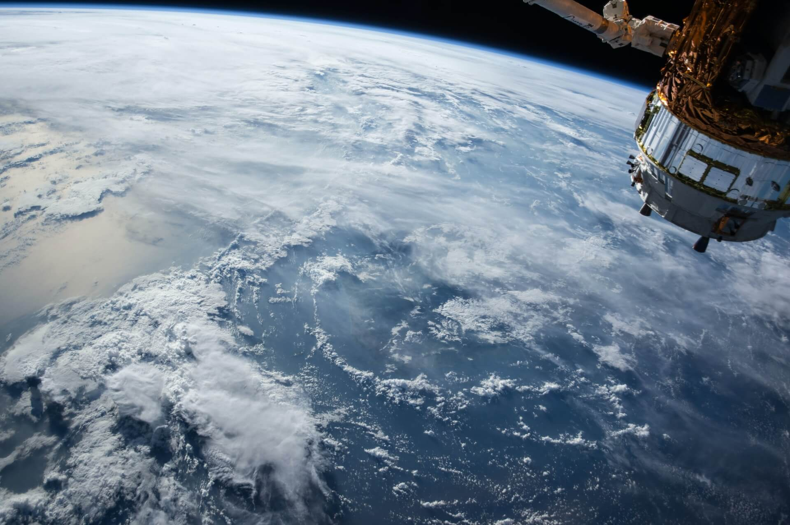

Space weather is a branch of space physics and aeronomy, or heliophysics, concerned with the time varying conditions within the Solar System, including the solar wind, emphasizing the space surrounding the Earth, including conditions in the magnetosphere, ionosphere, thermosphere, and exosphere. Space weather is distinct from but conceptually related to the terrestrial weather of the atmosphere of Earth (troposphere and stratosphere). The term space weather was first used in the 1950s and came into common usage in the 1990s.

## History

### Genesis

In 1724, George Graham reported that the needle of a magnetic compass was regularly deflected from magnetic north over the course of each day. This effect was eventually attributed to overhead electric currents flowing in the ionosphere and magnetosphere by Balfour Stewart in 1882, and confirmed by Arthur Schuster in 1889 from analysis of magnetic observatory data.

In 1852, astronomer and British major general Edward Sabine showed that the probability of the occurrence of magnetic storms on Earth was correlated with the number of sunspots, thus demonstrating a novel solar-terrestrial interaction. In 1859, a great magnetic storm caused brilliant auroral displays and disrupted global telegraph operations. Richard Carrington correctly connected the storm with a solar flare that he had observed the day before in the vicinity of a large sunspot group—thus demonstrating that specific solar events could affect the Earth.

Kristian Birkeland explained the physics of aurora by creating artificial aurora in his laboratory and predicted the solar wind. The introduction of radio revealed that periods of extreme static or noise occurred. Severe radar jamming during a large solar event in 1942 led to the discovery of solar radio bursts (radio waves which cover a broad frequency range created by a solar flare), another aspect of space weather.

### Twentieth century

In the 20th century the interest in space weather expanded as military and commercial systems came to depend on systems affected by space weather. Communications satellites are a vital part of global commerce. Weather satellite systems provide information about terrestrial weather. The signals from satellites of the Global Positioning System (GPS) are used in a wide variety of applications. Space weather phenomena can interfere with or damage these satellites or interfere with the radio signals with which they operate. Space weather phenomena can cause damaging surges in long distance transmission lines and expose passengers and crew of aircraft travel to radiation, especially on polar routes.

The International Geophysical Year (IGY) increased research into space weather. Ground-based data obtained during IGY demonstrated that the aurora occurred in an auroral oval, a permanent region of luminescence 15 to 25 degrees in latitude from the magnetic poles and 5 to 20 degrees wide. In 1958, the Explorer I satellite discovered the Van Allen belts, regions of radiation particles trapped by the Earth's magnetic field. In January 1959, the Soviet satellite Luna 1 first directly observed the solar wind and measured its strength. A smaller International Heliophysical Year (IHY) occurred in 2007-2008.

In 1969, INJUN-5 (a.k.a. Explorer 40) made the first direct observation of the electric field impressed on the Earth's high latitude ionosphere by the solar wind. In the early 1970s, Triad data demonstrated that permanent electric currents flowed between the auroral oval and the magnetosphere.

The term space weather came into usage in the late 1950s as the space age began and satellites began to measure the space environment. The term regained popularity in the 1990s along with the belief that space's impact on human systems demanded a more coordinated research and application framework.

## US National Space Weather Program

The purpose of the US National Space Weather Program is to focus research on the needs of the affected commercial and military communities, to connect the research and user communities, to create coordination between operational data centers and to better define user community needs.

The concept was turned into an action plan in 2000, an implementation plan in 2002, an assessment in 2006 and a revised strategic plan in 2010. A revised action plan was scheduled to be released in 2011 followed by a revised implementation plan in 2012.

One part of the National Space Weather Program is to show users that space weather affects their business. Private companies now acknowledge space weather "is a real risk for today's businesses".

## Phenomena

Within the Solar System, space weather is influenced by the solar wind and the interplanetary magnetic field (IMF) carried by the solar wind plasma. A variety of physical phenomena are associated with space weather, including geomagnetic storms and substorms, energization of the Van Allen radiation belts, ionospheric disturbances and scintillation of satellite-to-ground radio signals and long-range radar signals, aurora, and geomagnetically induced currents at Earth's surface. Coronal mass ejections (CMEs), their associated shock waves and coronal clouds are also important drivers of space weather as they can compress the magnetosphere and trigger geomagnetic storms. Solar energetic particles (SEP) accelerated by coronal mass ejections or solar flares can trigger solar particle events (SPEs), a critical driver of human impact space weather as they can damage electronics onboard spacecraft (e.g. Galaxy 15 failure), and threaten the lives of astronauts as well as increase radiation hazards to high-altitude, high-latitude aviation.

## Effects

### Spacecraft electronics

GOES-11 and GOES-12 monitored space weather conditions during the October 2003 solar activity.

Some spacecraft failures can be directly attributed to space weather; many more are thought to have a space weather component. For example, 46 of the 70 failures reported in 2003 occurred during the October 2003 geomagnetic storm. The two most common adverse space weather effects on spacecraft are radiation damage and spacecraft charging.

Radiation (high energy particles) passes through the skin of the spacecraft and into the electronic components. In most cases the radiation causes an erroneous signal or changes one bit in memory of a spacecraft's electronics (single event upsets). In a few cases, the radiation destroys a section of the electronics (single-event latchup).

Spacecraft charging is the accumulation of an electrostatic charge on a non-conducting material on the spacecraft's surface by low energy particles. If enough charge is built up, a discharge (spark) occurs. This can cause an erroneous signal to be detected and acted on by the spacecraft computer. A recent study indicates that spacecraft charging is the predominant space weather effect on spacecraft in geosynchronous orbit.

### Spacecraft orbit changes

The orbits of spacecraft in low Earth orbit (LEO) decay to lower and lower altitudes due to the resistance from the friction between the spacecraft's surface (i.e. , drag) and the outer layer of the Earth's atmosphere (a.k.a. the thermosphere and exosphere). Eventually, a LEO spacecraft falls out of orbit and towards the Earth's surface. Many spacecraft launched in the past couple of decades have the ability to fire a small rocket to manage their orbits. The rocket can increase altitude to extend lifetime, to direct the reentry towards a particular (marine) site, or route the satellite to avoid collision with other spacecraft. Such maneuvers require precise information about the orbit. A geomagnetic storm can cause an orbit change over a couple of days that otherwise would occur over a year or more. The geomagnetic storm adds heat to the thermosphere, causing the thermosphere to expand and rise, increasing the drag on spacecraft. The 2009 satellite collision between the Iridium 33 and Cosmos 2251 demonstrated the importance of having precise knowledge of all objects in orbit. Iridium 33 had the capability to maneuver out of the path of Cosmos 2251 and could have evaded the crash, if a credible collision prediction had been available.

### Humans in space

The exposure of a human body to ionizing radiation has the same harmful effects whether the source of the radiation is a medical X-ray machine, a nuclear power plant or radiation in space. The degree of the harmful effect depends on the length of exposure and the radiation's energy density. The ever-present radiation belts extend down to the altitude of crewed spacecraft such as the International Space Station (ISS) and the Space Shuttle, but the amount of exposure is within the acceptable lifetime exposure limit under normal conditions. During a major space weather event that includes an SEP burst, the flux can increase by orders of magnitude. Areas within ISS provide shielding that can keep the total dose within safe limits. For the Space Shuttle, such an event would have required immediate mission termination.

### Ground systems

#### Spacecraft signals

The ionosphere bends radio waves in the same manner that water in a swimming pool bends visible light. When the medium through which such waves travel is disturbed, the light image or radio information is distorted and can become unrecognizable. The degree of distortion (scintillation) of a radio wave by the ionosphere depends on the signal frequency. Radio signals in the VHF band (30 to 300 MHz) can be distorted beyond recognition by a disturbed ionosphere. Radio signals in the UHF band (300 MHz to 3 GHz) transit a disturbed ionosphere, but a receiver may not be able to keep locked to the carrier frequency. GPS uses signals at 1575.42 MHz (L1) and 1227.6 MHz (L2) that can be distorted by a disturbed ionosphere. Space weather events that corrupt GPS signals can significantly impact society. For example, the Wide Area Augmentation System (WAAS) operated by the US Federal Aviation Administration (FAA) is used as a navigation tool for North American commercial aviation. It is disabled by every major space weather event. Outages can range from minutes to days. Major space weather events can push the disturbed polar ionosphere 10° to 30° of latitude toward the equator and can cause large ionospheric gradients (changes in density over distance of hundreds of km) at mid and low latitude. Both of these factors can distort GPS signals.

### Long-distance radio signals

Radio wave in the HF band (3 to 30 MHz) (also known as the shortwave band) are reflected by the ionosphere. Since the ground also reflects HF waves, a signal can be transmitted around the curvature of the Earth beyond the line of sight. During the 20th century, HF communications was the only method for a ship or aircraft far from land or a base station to communicate. The advent of systems such as Iridium brought other methods of communications, but HF remains critical for vessels that do not carry the newer equipment and as a critical backup system for others. Space weather events can create irregularities in the ionosphere that scatter HF signals instead of reflecting them, preventing HF communications. At auroral and polar latitudes, small space weather events that occur frequently disrupt HF communications. At mid-latitudes, HF communications are disrupted by solar radio bursts, by X-rays from solar flares (which enhance and disturb the ionospheric D-layer) and by TEC enhancements and irregularities during major geomagnetic storms.

Transpolar airline routes are particularly sensitive to space weather, in part because Federal Aviation Regulations require reliable communication over the entire flight. Diverting such a flight is estimated to cost about $100,000.

### Humans in commercial aviation

The magnetosphere guides cosmic ray and solar energetic particles to polar latitudes, while high energy charged particles enter the mesosphere, stratosphere, and troposphere. These energetic particles at the top of the atmosphere shatter atmospheric atoms and molecules, creating harmful lower energy particles that penetrate deep into the atmosphere and create measurable radiation. All aircraft flying above 8 km (26,200 feet) altitude are exposed to these particles. The dose exposure is greater in polar regions than at mid-latitude and equatorial regions. Many commercial aircraft fly over the polar region. When a space weather event causes radiation exposure to exceed the safe level set by aviation authorities, the aircraft's flight path is diverted.

While the most significant, but highly unlikely, health consequences to atmospheric radiation exposure include death from cancer due to long-term exposure, many lifestyle-degrading and career-impacting cancer forms can also occur. A cancer diagnosis can have significant career impact for a commercial pilot. A cancer diagnosis can ground a pilot temporarily or permanently. International guidelines from the International Commission on Radiological Protection (ICRP) have been developed to mitigate this statistical risk. The ICRP recommends effective dose limits of a 5-year average of 20 mSv per year with no more than 50 mSv in a single year for non-pregnant, occupationally exposed persons, and 1 mSv per year for the general public. Radiation dose limits are not engineering limits. In the U.S., they are treated as an upper limit of acceptability and not a regulatory limit.

Measurements of the radiation environment at commercial aircraft altitudes above 8 km (26,000 ft) have historically been done by instruments that record the data on board where the data are then processed later on the ground. However, a system of real-time radiation measurements on-board aircraft has been developed through the NASA Automated Radiation Measurements for Aerospace Safety (ARMAS) program. ARMAS has flown hundreds of flights since 2013, mostly on research aircraft, and sent the data to the ground through Iridium satellite links. The eventual goal of these types of measurements is to data assimilate them into physics-based global radiation models, e.g., NASA's Nowcast of Atmospheric Ionizing Radiation System (NAIRAS), so as to provide the weather of the radiation environment rather than the climatology.

### Ground-induced electric fields

Magnetic storm activity can induce geoelectric fields in the Earth's conducting lithosphere. Corresponding voltage differentials can find their way into electric power grids through ground connections, driving uncontrolled electric currents that interfere with grid operation, damage transformers, trip protective relays and sometimes cause blackouts. This complicated chain of causes and effects was demonstrated during the magnetic storm of March 1989, which caused the complete collapse of the Hydro-Québec electric-power grid in Canada, temporarily leaving nine million people without electricity. The possible occurrence of an even more intense storm led to operational standards intended to mitigate induction-hazard risks, while reinsurance companies commissioned revised risk assessments.

### Geophysical exploration

Air- and ship-borne magnetic surveys can be affected by rapid magnetic field variations during geomagnetic storms. Such storms cause data interpretation problems because the space-weather-related magnetic field changes are similar in magnitude to those of the sub-surface crustal magnetic field in the survey area. Accurate geomagnetic storm warnings, including an assessment of storm magnitude and duration allows for an economic use of survey equipment.

### Geophysics and hydrocarbon production

For economic and other reasons, oil and gas production often involves horizontal drilling of well paths many kilometers from a single wellhead. Accuracy requirements are strict, due to target size – reservoirs may only be a few tens to hundreds of meters across – and safety, because of the proximity of other boreholes. The most accurate gyroscopic method is expensive, since it can stop drilling for hours. An alternative is to use a magnetic survey, which enables measurement while drilling (MWD). Near real-time magnetic data can be used to correct drilling direction. Magnetic data and space weather forecasts can help to clarify unknown sources of drilling error.
Terrestrial weather
The amount of energy entering the troposphere and stratosphere from space weather phenomena is trivial compared to the solar insolation in the visible and infra-red portions of the solar electromagnetic spectrum. Although some linkage between the 11-year sunspot cycle and the Earth's climate has been claimed., this has never been verified. For example, the Maunder minimum, a 70-year period almost devoid of sunspots, has often been suggested to be correlated to a cooler climate, but these correlations have disappeared after deeper studies. The suggested link from changes in cosmic ray flux cause changes in the amount of cloud formation. did not survive scientific tests. Another suggestion, that variations in the EUV flux subtly influence existing drivers of the climate and tip the balance between El Niño/La Niña events. collapsed when new research showed this was not possible. As such, a linkage between space weather and the climate has not been demonstrated.

## Notable events

- On December 21, 1806, Alexander von Humboldt observed that his compass had become erratic during a bright auroral event.
- The Solar storm of 1859 caused widespread disruption of telegraph service.
- The Aurora of November 17, 1882 disrupted telegraph service.
- The May 1921 geomagnetic storm, one of the largest geomagnetic storms disrupted telegraph service and damaged electrical equipment worldwide.
- The Solar storm of August 1972, a large SEP event occurred. If astronauts had been in space at the time, the dose could have been life-threatening.
- The March 1989 geomagnetic storm included multiple space weather effects: SEP, CME, Forbush decrease, ground level enhancement, geomagnetic storm, etc..
- The 2000 Bastille Day event coincided with exceptionally bright aurora.
- April 21, 2002, the Nozomi Mars Probe was hit by a large SEP event that caused large-scale failure. The mission, which was already about 3 years behind schedule, was abandoned in December 2003.

Source: [Wikipedia](https://en.wikipedia.org/wiki/Space_weather).